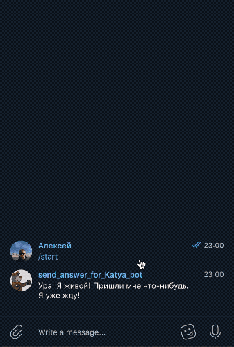

# Бот для ответов на присланные картинки
### Автор проекта: Алексей Свирин, телеграм — [@svirin](https://telegram.me/svirin)
### Цель проекта: создание бота, которые отвечает на присланные картинки заранее заготовленными фразами или стикерами



# Как установить
### Этап 1. Получить все авторизационные ключи
#### Этап 1.1 Для запуска бота в Телеграме необходимо:
1) Создать бота для пользователй в telegram через [Отца ботов](https://telegram.me/BotFather) и взять токен для авторизации.
2) Создать бота для сервисных сообщений в telegram через [Отца ботов](https://telegram.me/BotFather) и взять токен для авторизации.
3) Узнать свой ID через [специального бота](https://telegram.me/userinfobot).

### Этап 2. Установить переменные окружения
1) TELEGRAM_TOKEN — токен для авторизации бота в Телеграме;
2) TELEGRAM_BOT_INFORMATION_TOKEN — токен для авторизации бота для информационных сообщений;
3) CHAT_ID_TELEGRAM_INFORMATION — кому бот для информационных сообщений будет писать;
4) LIST_ANSWERS — строка с текстовыми ответами и разделителем ';';
5) LIST_STICKERS — строка с file_id стикеров телеграма и разделителем ';';
6) STANDART_TEXT_PHRASE — стандартная фраза-ответ на присланное текстовое сообщение, так как бот отвечает только на картинки;
7) START_PHRASE — приветствие для пользователя.

### Этап 3. Запустить бота 
#### Пример запуска в консоли
```python
python3 tg-bot.py
```

# Требования к окружению
Все требуемые модули указаны в файле requirements.txt  
Для установки запустите команду:
```python
python3 pip install -r requirements.txt
```

# Требования к запуску на Heroku
Для запуска на Heroku необходимо:
1) Файл Procfile. В файле Procfile прописано какой файл нужно запускать на Heroku;
2) Файл Pipfile. В файлах Pipfile и reqirements.txt указаны необходимые модули для работы бота;
3) В раздел Config Vars добавить все переменные окружения.
